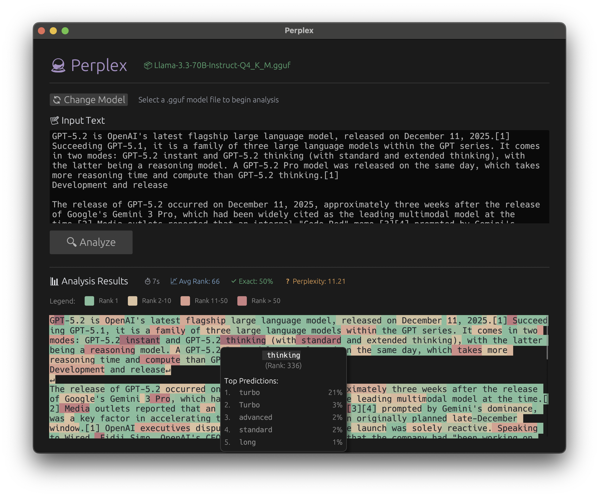

# Perplex

This offline tool allows you to analyze a given text and see how "surprising" it is to a LLM. It may be useful to see if a text is AI-generated (but it's not its purpose) or simply to understand how LLMs work under the hood.

This is based on the awesome work by the [llama.cpp](https://github.com/ggml-org/llama.cpp) team, so you will need to specify yout `.gguf` file to use it.

## Usage

1. Build and run the app with `cargo run --release`
2. Select a GGUF model file
3. Paste or write a text in the input field
4. Click `analyze`
5. See the results

The **green** tokens are the ones the LLM predicted almost perfectly, while the **red** ones are the most surprising to the model.

You can hover on a specific token to see its how it ranked in the model's predicitons along with the top-5 leaderboard of the highest probability tokens.